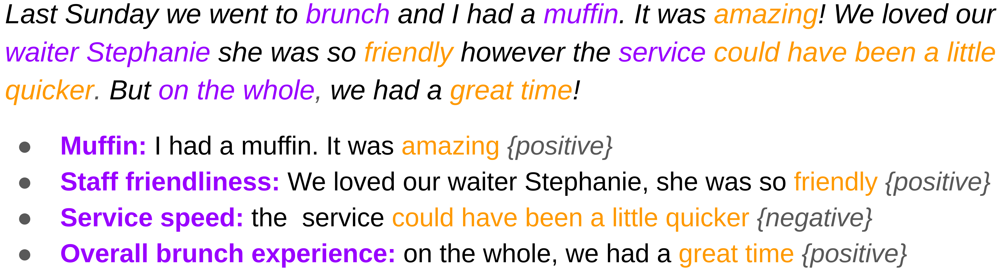

# Opinion Units: Concise and Contextualized Representations for Aspect-Based Sentiment Analysis

Welcome to the repository for Opinion Units, a ncontribution to Aspect-Based Sentiment Analysis (ABSA), a contribution to the field Aspect-Based Sentiment Analysis (ABSA) that extends aspect-sentiment pairs by including substantiating excerpts. We generate opinion units using LLMs, focusing our evaluation on restaurant reviews. An example of generated opinion units from a restaurant review is seen in the image below.

The full article on Opinion Units was published at the Joint 25th Nordic Conference on Computational Linguistics (NoDaLiDa). You can access it [here](https://emilhagl.github.io/research/article-1.html)

## Codes and guide for generating Opinion Units

This repository includes code and guides for generating Opinion Units.

The prompt template for generating Opinion Units is provided in: prompt_template.md and code for creating opinion units from YELP restaurant reviews and OpenAI's LLM APIs are provided in the file: opinion_units_CREATE_EMBED_STORE.ipynb. This file also provides functionality for transforming the generated opinion units into word embeddings and storing them in a local vector database.    

## Materials for case study on opinion search

This repository also includes resources for the case study on opinion search, described in the full article. In this case study, opinion units are compared to sentence and passage chunking on 50 self-designed retrieval tasks for opinions occuring in restaurant reviews.

Code and guides for implementing sentence and passage chunking, along with their embedding and storage, are provided in the file: sentence_passage_chunking_CREATE_EMBED_STORE.ipynb

Code and guide for querying the restaurant reviews are provided in: Query_reviews.ipynb

The tasks for the case study are provided in the file: restaurant_tasks.xml.
